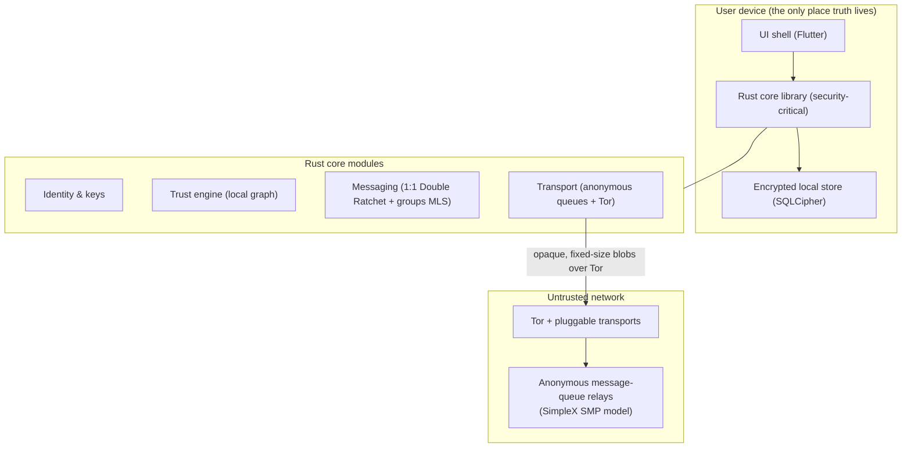

# Technical Specification — Local-First Web of Trust

**Project:** A web of trust for LGBTQ+ people at risk
**Status:** Draft v0.1 — engineering spec, to be reviewed alongside `threat-model.md`
**Foundation (per threat model §9):** Local-first, invitation-only, compartmentalised.
New app, built **only from proven/audited libraries**. MVP delivers the **trust engine
and safe messaging together**.

> Every choice here is justified against a requirement ID (e.g. `7.2`, `S3`) from
> `threat-model.md`. If a requirement and this spec ever conflict, the threat model wins.

---

## 1. System overview



**Principles realised:** the device holds all truth (`7.5`); relays see only opaque
fixed-size blobs in anonymous queues (`A2`, `S4`); the network layer hides metadata
(`A4`, `S2`, `S5`); the trust graph is computed locally with a 1-hop horizon (`7.2`, `S3`).

---

## 2. Technology stack & rationale

| Layer | Choice | Why (req) | Alternatives considered |
|------|--------|-----------|--------------------------|
| Security-critical core | **Rust**, compiled to Android (JNI/UniFFI), iOS (UniFFI), desktop | One audited codebase; memory safety; no GC timing leaks | Kotlin/Swift per-platform (2x audit surface) |
| UI shell | **Flutter** (Dart) over the Rust core via FFI | One cross-platform UI; cheap-Android friendly (`7.8`) | React Native; native per-OS |
| 1:1 crypto | **Olm Double Ratchet via `vodozemac`** (audited, pure Rust) — *deviation from spec's libsignal; see §7.1* | Audited, forward secrecy + post-compromise (`7.3`); hermetic crates.io build | libsignal (git-only/AGPL/BoringSSL — not hermetic); custom (rejected — `7.3` forbids own crypto) |
| Group crypto | **Megolm group ratchet via `vodozemac`** for the MVP — *deviation from spec's OpenMLS; see §7.2* (OpenMLS/RFC 9420 later for scale) | Audited, hermetic (same crate as 1:1); sender ratchets with FS + key rotation (PCS) on membership change | OpenMLS now (heavier second dep); custom (rejected — `7.3`) |
| Transport / delivery | **SimpleX SMP model** (anonymous unidirectional queues + 2-hop private routing), run over **Tor** w/ pluggable transports | No user identifiers; relays can't link sender↔recipient; censorship-resistant (`A1`,`A2`,`A4`,`S2`,`S4`) | Matrix (server-side graph — rejected); raw P2P (NAT/availability pain) |
| Local storage | **SQLCipher** (AES-256), key from **Argon2id** | Encrypted at rest (`7.3`); duress vaults (`7.6`) | Plain SQLite + file crypto (more error-prone) |
| Optional zk layer | **Semaphore v4** per-community groups | Anonymous vouch/vote without identity (`6` optional B) | This repo's Compact/Midnight demo (port ideas, not base) |

**Build/distribution:** open source, **reproducible signed builds** (`7.7`), with an
out-of-store APK channel for regions where stores are coerced/blocked (`S7`).

> On reuse: rather than reimplement metadata-resistant delivery, we adopt the **SimpleX
> SMP protocol** as transport (open source, battle-tested, no user IDs). We integrate at
> the protocol/relay level so our app controls UX, identity, and the trust engine while
> reusing their proven queue + private-routing network.

---

## 3. Identity model (`7.1`)

No PII, ever. A user is a set of on-device keys, not an account.

```
Identity {
  id_seed            : 32 bytes (CSPRNG)           # never leaves device
  signing_keypair    : Ed25519                     # signs vouches/attestations
  dr_identity        : Olm (vodozemac) account     # 1:1 sessions (Double Ratchet)
  mls_credential     : OpenMLS BasicCredential      # group identity (per community)
  display_nickname   : string (local, user-set; not unique, not network-visible)
  created_at         : local timestamp
}
```

- **No global identifier is ever published.** Contact happens only via one-time invite
  tokens (§5), exactly like SimpleX's "no identifiers" model.
- **Per-community pseudonymity:** a distinct `mls_credential` per community so the same
  person is unlinkable across communities (`A2`).
- **Recovery (`7.1`):** a 24-word recovery phrase (BIP39-style) deterministically
  reseeds `id_seed`. User-held offline only; never escrowed. Losing it = losing the
  identity (acceptable and safer than any server-side recovery).
- **Multiple identities / compartments (`7.1` SHOULD):** the store supports N isolated
  identities; the duress vault (§9) is implemented as a separate identity.

---

## 4. Local data model (the web of trust)

All rows live in the encrypted local store. **A user only ever stores their own 1-hop
neighbourhood** (`7.2`, `S3`, `S6`).

```sql
-- Direct contacts (1 hop only — never their contacts)
contact(
  contact_id        BLOB PRIMARY KEY,   -- random local handle, not networkable
  pubkey_sign       BLOB,               -- Ed25519 verifying key
  nickname          TEXT,
  added_via         TEXT,               -- 'invite' | 'vouched_intro'
  inviter_id        BLOB NULL,          -- who introduced them (1 hop)
  tier              INTEGER,            -- current capability tier (see §6)
  status            TEXT,               -- 'active' | 'burned' | 'paused'
  first_seen        INTEGER
);

-- Signed vouches I have RECEIVED about a contact (from my other contacts).
-- I never learn about vouches beyond my horizon.
vouch(
  vouch_id          BLOB PRIMARY KEY,
  subject_id        BLOB,               -- contact being vouched for
  voucher_id        BLOB,               -- one of MY contacts who vouched
  weight            INTEGER,            -- 1..3, voucher-asserted confidence
  signature         BLOB,               -- Ed25519 over (subject_pubkey, weight, ts, nonce)
  created_at        INTEGER,
  revoked_at        INTEGER NULL
);

-- Local burn/revocation signals received from 1-hop neighbours
burn_signal(
  signal_id         BLOB PRIMARY KEY,
  subject_id        BLOB,
  origin_id         BLOB,               -- a contact who flagged the subject
  reason_code       INTEGER,            -- coarse, non-identifying
  signature         BLOB,
  created_at        INTEGER
);
```

Note there is deliberately **no table of the global graph** and **no "friends of
friends" enumeration** beyond what vouches a user directly receives. A captured device
reveals only its own contacts and the vouches it received (`S6`).

---

## 5. Trust establishment protocol

### 5.1 Invitation (only way in) (`7.2`, `S11`)

```mermaid
sequenceDiagram
    participant A as Existing member (inviter)
    participant B as New person
    A->>A: Generate one-time invite token (TTL, single-use)
    Note over A,B: Shared out-of-band: in-person QR, or via an existing trusted channel
    B->>Relays: Redeem token to set up an anonymous reply queue
    A->>B: Establish X3DH/PQXDH session over queues
    Note over A,B: B enters at Tier 0; A is B's only contact
```

- Tokens are **single-use, short-TTL, capability-scoped**, and contain only ephemeral
  queue/keys (no identity). Expired/used tokens are inert (`S11`).
- **No stranger discovery exists** — there is no address book, no search (`6`).

### 5.2 Vouching (`7.2`)

A contact can issue a signed vouch about another of your contacts (an introduction):

```
Vouch = Sign_voucher( subject_pubkey || weight(1..3) || timestamp || nonce )
```

- Vouching is **accountable**: if `subject` is later burned, the voucher's contributions
  are devalued and the voucher's own tier with you can drop (skin in the game, `7.2`).
- Vouches are only ever shared with the 1-hop neighbour they concern; they do not
  propagate transitively (no global graph, `S3`).

### 5.3 Burn / revocation (`7.2`, `S6`)

If you flag a contact as compromised, a `burn_signal` is gossiped **only to your direct
contacts who also know that subject**. No global broadcast. Recipients devalue the
subject and are prompted to review shared content (which can be remotely expired, `7.3`).

---

## 6. Trust scoring & capability tiers

Computed **locally**, from only the data the user can see (`7.2`). Reference algorithm
(parameters are policy, tuned with partners):

```
# For a contact C, from the perspective of user U:
base        = tier_floor_from_how_added(C)          # invite=0.2, vouched_intro=0.0
vouch_score = Σ over active vouches v about C:
                 w(v) * voucher_trust(U, v.voucher) * decay(age(v))
burn_penalty= Σ over burn_signals about C:
                 k * origin_trust(U, b.origin)

raw         = base + vouch_score - burn_penalty
trust(C)    = clamp(raw, 0, 1)
```

- `voucher_trust` uses the *voucher's own* tier with U (one level only — no recursion
  past the 1-hop horizon, preserving `S3`).
- `decay` lowers the weight of stale vouches; `k` makes a single credible burn strongly
  negative (safety-biased — false "unsafe" is cheaper than false "safe").

### Tier → capability mapping (`7.2`)

| Tier | Trust threshold | Unlocked capability |
|------|-----------------|---------------------|
| 0 — invited | added via invite | 1:1 chat with inviter only |
| 1 — vouched | ≥ 1 independent vouch | small group chat; receive signed resources |
| 2 — trusted | ≥ 2 *independent* vouches | file sharing; larger communities |
| 3 — core | high multi-path trust | host a community; optional pooled-fund participation (LATER) |

"Independent" = vouchers who are not themselves vouched solely by each other (cheap
Sybil-cluster check within the 1-hop horizon).

---

## 7. Messaging & sharing

### 7.1 One-to-one
- **Double Ratchet**: 3DH pre-key handshake → Double Ratchet. Forward secrecy + PCS (`7.3`).
- **Disappearing by default** (`7.3`): per-conversation TTL, default on.
  > **Implemented (`core/src/messaging.rs`).** Forward-secret 1:1 channels are done, built on
  > the audited **Olm** Double Ratchet via the pure-Rust **`vodozemac`** crate (we never roll
  > our own ratchet). A `Device` owns the Olm account; a responder publishes a one-time
  > `PreKeyBundle` (alongside the invite), the initiator calls `start_session`, and the first
  > ciphertext is a pre-key message the responder feeds to `accept_session`. Steady-state
  > `encrypt`/`decrypt` advance the ratchet; the disappearing-message TTL travels **inside**
  > the encrypted payload so the relay never sees it. The wire form `type ‖ olm-ciphertext` is
  > padded to a fixed block (`framing::pad`) before transport.
  >
  > **Deviation from the named libsignal.** libsignal is not consumable as a hermetic Rust
  > dependency — git-only (not on crates.io), AGPL, and dependent on BoringSSL + forked crates
  > — which conflicts with this crate's pure, reproducible, cross-platform build. `vodozemac`
  > implements the same Double Ratchet (Olm), is pure Rust on crates.io, is independently
  > audited (Least Authority, no significant findings), and provides Megolm for §7.2 groups.
  > Trade-off vs. Signal: Olm's pre-key handshake is classic 3DH (no X3DH one-time-prekey
  > signing nuances and **no PQXDH post-quantum** step). PQ hardening is tracked as future
  > work; it does not block the MVP.

### 7.2 Groups / communities
- **Implemented (MVP): Megolm group ratchet** (`vodozemac`, module `group`). Each member has
  one outbound sender ratchet plus an inbound ratchet per other member; a message is encrypted
  once and fanned out. `add_member` enforces the Tier-1+ (`group_chat`) gate; `remove_member`
  rotates the outbound ratchet (PCS on removal); a later-added member is given the sender key at
  its current index, so it cannot read prior history (FS on join). Sender keys distribute over
  the 1:1 channels (§7.3 messaging); ciphertext pads (`framing`) onto the queue (§7.4).
  > **Deviation from the named OpenMLS.** OpenMLS (RFC 9420) gives tree-based continuous group
  > key agreement that scales to large/dynamic groups, but it is a second, heavier dependency.
  > Megolm delivers the same group-E2EE shape we need for the MVP (sender ratchets, FS, key
  > rotation on membership change) from the crate we already use for 1:1 and that is
  > independently audited (Least Authority), keeping the build pure/hermetic. An MLS upgrade is
  > worthwhile once groups must scale; the `group` API (sender-key distribution + ciphertext
  > envelopes) is the seam where that swap would happen.
- **Later (RFC 9420 / OpenMLS)**: scalable group E2EE; async joins via KeyPackages published to
  a relay; membership changes via Commit/Welcome. PCS on every key update.
- Group membership is gated by tier (§6). A community admin (Tier 3) curates joins.

### 7.3 Files & resources (`7.3`)
- Files: chunked, E2EE, size-limited, **expiring**; transferred over the same queues;
  large transfers can use a relay as encrypted store-and-forward (relay sees only blobs).
- **Signed resources** (legal help, safe houses, mental-health, VPN/Tor guides): authored
  content signed by origin, propagated through the trust graph with provenance so users
  can judge the source.

### 7.4 Delivery & metadata resistance (`A4`, `S2`, `S5`)
- **Anonymous unidirectional queues** (SMP model): separate send/receive queues with
  random per-contact addresses; relays cannot link the two sides.
  > **Protocol kernel implemented (`core/src/queue.rs`).** A simplex queue is named by two
  > independent random ids (recipient + sender) carrying no identity. The receiver holds a
  > per-queue Ed25519 recipient key; the one contact holds a separate sender key. Reads
  > (receive/ack/delete) require the recipient key; writes require the sender key — so a
  > contact who can write to you cannot read your queue and never learns its recipient id
  > (**capability separation**). Every command is signed over a domain-separated canonical
  > encoding and verified by the relay; a reference `InMemoryRelay` enforces all of this and is
  > the untrusted party in tests. The networked client (these commands over Tor, below) is the
  > remaining work; the relay already only ever sees opaque, fixed-size blobs.
- **2-hop private routing** hides sender IP/session from the recipient's chosen relay.
- **Run over Tor** with pluggable transports/bridges where the network is hostile.
- **Fixed-size (16KB) blocks**, batching/delay, and optional **cover traffic** to resist
  timing correlation (`S5`).
  > **Implemented (`core/src/framing.rs`).** The length-hiding kernel is done and pure:
  > every payload is padded into a fixed `BLOCK_SIZE` (16 KiB) block (length prefix + payload
  > + zero pad) and sealed with XChaCha20-Poly1305 (reusing the audited `at_rest` AEAD), so
  > every blob is exactly `SEALED_LEN` bytes — a relay sees only equal-sized opaque blobs
  > with no length signal. Padding is inside the AEAD (confidential + authenticated); wrong
  > key, tampering, and wrong-size blobs are rejected. The per-message key comes from the
  > ratchet (1.4); the Tor/SMP queue plumbing and cover traffic layer on top.
- **No identity-linked push tokens** (`S12`): wake via background fetch/poll or P2P,
  never APNs/FCM identifiers tied to a user.

---

## 8. Local storage & encryption at rest (`7.3`, `7.6`)

- **SQLCipher** database; key = `Argon2id(passphrase, salt, hardened params)`, optionally
  wrapped by the OS keystore/Secure Enclave when present.
- Keys held in locked memory, zeroised on lock/background.
- **Auth on every open** (`7.6`): passphrase/PIN, biometric optional with passphrase
  fallback.
- No plaintext anywhere on disk; no content in OS-level backups (`6`).

> **Implementation status (core):** to keep the Rust core pure, hermetically testable, and
> free of native dependencies, the encrypted store is currently a pure-Rust **vault**
> (`core/src/at_rest.rs`): an **Argon2id**-derived key sealing the serialized store with
> **XChaCha20-Poly1305** (header, including KDF parameters, authenticated; untrusted
> parameters bounded). This satisfies `7.3`/`7.6` without SQLCipher. SQLCipher remains an
> option if/when a *queryable* encrypted DB is needed; it would reuse the same Argon2id key.

---

## 9. Coercion & device-loss resilience (`7.6`, `S1`, `S9`)

- **Duress vault:** two (or more) passphrases derive two independent keys. The
  *duress* passphrase opens a believable **decoy identity** with innocuous contacts/chats;
  the real vault is cryptographically invisible (deniable). No flag distinguishes them on
  disk.
  > **Implemented (`core/src/duress.rs`).** A `DeniableVault` holds a fixed number of
  > fixed-size **compartments** ("slots") in one blob. Each slot is `salt | nonce |
  > XChaCha20-Poly1305(len‖data‖random-pad)` — all indistinguishable from random — and
  > unused slots are filled with random bytes, so the cleartext geometry header reveals only
  > the *maximum* capacity, never how many slots are real. Keys are Argon2id-derived
  > (per-slot salt) reusing the audited `at_rest` KDF/AEAD primitives. `open(passphrase)`
  > derives against every slot and returns whichever one's AEAD tag verifies, performing a
  > constant number of derivations and returning the same `Decrypt` error whether the
  > passphrase is wrong or simply absent — no oracle, no timing tell for the matching slot.
  > A decoy-only process saves by rewriting *only its own* slot, leaving the (unreadable)
  > hidden compartment byte-for-byte intact. This satisfies `7.6` without SQLCipher.
- **Panic action:** a configurable gesture/PIN triggers fast-hide and/or secure wipe of
  the real vault. *(`wipe_slot`/`wipe_all` overwrite a compartment with fresh random bytes,
  leaving it indistinguishable from a never-used slot; gesture wiring lands with the UI.)*
- **App disguise (`7.6` SHOULD):** alternate icon/name (e.g. a calculator/notes facade);
  optional hidden launch.
- **Minimal on-device footprint:** only the 1-hop horizon is stored, capping blast radius
  if the device is seized and the real vault is opened under coercion (`S6`).

---

## 10. Optional zero-knowledge layer (per-community only) (`6` option B)

When a community needs **anonymous** collective actions (e.g. "a verified member vouches
/ votes" without revealing which member), add a **Semaphore v4** group *scoped to that
community*:

- Each member adds a Semaphore identity commitment to the community's Merkle group.
- Members generate zk proofs of membership + a **nullifier** to act once per context
  (anonymous vote, anonymous "I vouch", anonymous access to a pooled resource).
- This mirrors this repo's demo: `contracts/nullifier-pattern.compact` (membership +
  one-shot nullifier) and the sparse-Merkle non-membership work for **revocation** (prove
  a credential hasn't been burned). We port the *patterns* to the more mature,
  audited Semaphore stack.

**Hard constraint:** the zk group is per-community and small; it is **never** a global
registry of all users (would violate `A2`/`S3`). Any on-chain interaction must be wrapped
in the mixnet/Tor transport to avoid IP/timing leaks (`S2`, `S5`).

---

## 11. MVP scope (trust engine + safe messaging, together)

**In:**
1. Identity creation + 24-word recovery (`7.1`).
2. Invitation-only onboarding via in-person QR / one-time link (`7.2`).
3. 1:1 E2EE chat (Olm Double Ratchet via `vodozemac`) with disappearing messages (`7.3`).
4. Local trust engine: contacts, vouches, trust scoring, tiers 0–2 (§6).
5. Burn/revocation gossip to 1-hop (`7.2`).
6. Anonymous-queue transport over Tor (SMP model) (`7.4`).
7. Encrypted store + auth-on-open + duress vault + app disguise (`7.6`).
8. Small-group chat (Megolm group ratchet; OpenMLS later) gated at Tier 1+ (`7.2`).

**Deferred (LATER):** funds/mutual aid (legal review first, `S10`); the zk layer (§10);
cover-traffic tuning; multi-device.

**MVP acceptance = the MUST requirements in `threat-model.md` §7 that apply to the above,
verified by the test plan (§12).**

---

## 12. Verification & test plan

- **Crypto:** rely on upstream audits (vodozemac/Olm, OpenMLS, SMP); add integration tests
  for handshake, ratchet, group add/remove, KeyPackage flows.
- **Metadata tests (`A4`,`S5`):** assert fixed-size blocks, no plaintext identifiers on
  the wire, sender↔recipient unlinkability at a relay we instrument as an adversary.
- **Trust-engine tests:** Sybil-cluster scenarios, burn propagation, tier transitions,
  1-hop horizon never exceeded (`S3`).
- **Coercion tests (`S1`,`S9`):** duress vault indistinguishability; panic wipe; no
  plaintext at rest; nothing leaks from OS backups.
- **Adversarial review:** independent security & privacy audit before any at-risk user
  onboards (`7.9`). Red-team the invite/vouch flow for infiltration (`S3`,`S11`).

---

## 13. Open engineering questions

1. Integrate SimpleX SMP via their core/SDK, or implement a Rust SMP client against their
   relays? (Effort vs. control trade-off.)
2. Run our own relays, rely on the public SimpleX relay network, or both? (Availability
   vs. trust diversity — relays are untrusted either way.)
3. Flutter-over-Rust FFI vs. fully native UI for the most security-sensitive screens.
4. Group model: pure MLS vs. MLS for larger communities + 1:1 ratchet for small — where's
   the cutover?
5. Offline/store-and-forward retention window on relays (deliverability vs. metadata).
```
